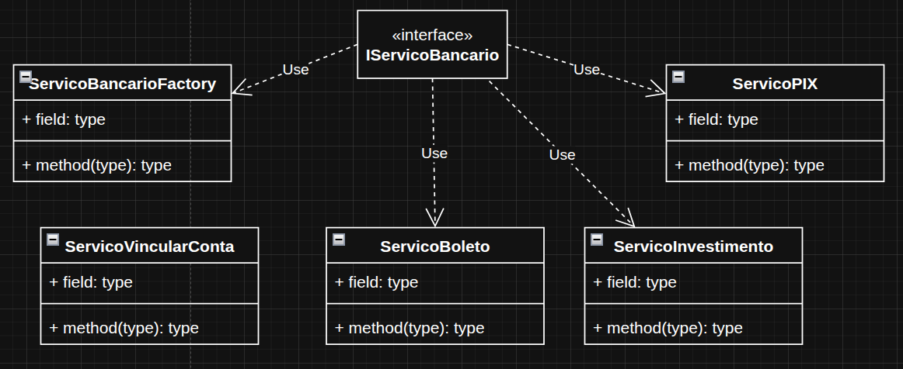

# Factory Method

O padrão Factory Method é um padrão de projeto criacional que serve para criar objetos sem expor diretamente a lógica de criação. O desenvolvedor delega a tarefa de instanciar objetos a um método (a fábrica). Assim, o código principal trabalha apenas com interfaces ou classes abstratas, enquanto as subclasses decidem qual objeto concreto criar.

Nesse exemplo criado, foi abordado um sistema simples bancário, onde possui uma interface e todos os serviços que são implementados a partir dessa interface são fabricados pelo método `obterServico()`, os que não possuem relação com a interface não fazem parte do Factory Method.

Esse método auxilia bastante na criação de novas classes, já que já possui um modelo com o básico e essencial para a criação e funcionamento de um novo recurso.

